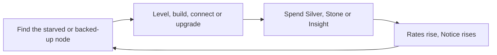
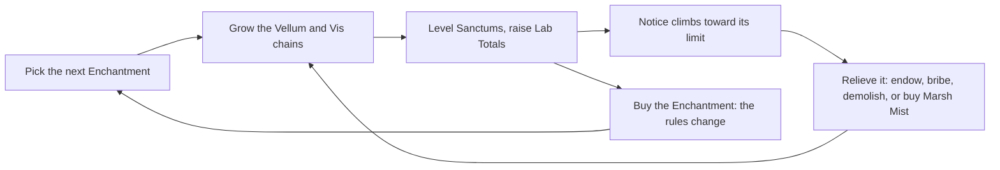
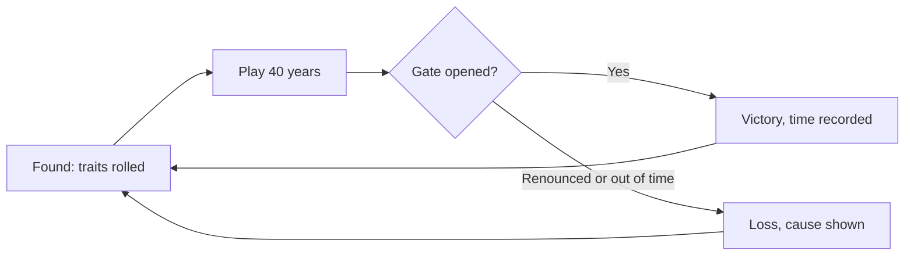

# Aura — Core MVP Spec

## 0. How to read this

**Aura** is a single-player incremental ("number go up") game about growing a covenant of wizards in 13th-century Normandy. Its tagline is *The Covenant Must Grow*. This spec defines the smallest version that plays from start to finish: one run of about 60–80 minutes, one map, one win condition, two ways to lose. It makes no technology choices; it could be built as a web page, in a game engine, or as a board game. It is meant to be read on its own, without any earlier document.

### Inspirations

| Game | What we take from it |
| --- | --- |
| Factorio | Chains of producers; find the starved machine and fix it; growth wakes enemies |
| Kittens Game, Cookie Clicker, Antimatter Dimensions | Exponential outputs against faster-exponential costs; multiplier stacking |
| Shapez, Mini Metro | Abstract links instead of placed belts; throughput tiers |
| Ars Magica (tabletop RPG) | Setting, magic economy, and characters and places defined by short evocative traits |
| Cultist Simulator, Crusader Kings | Characters whose traits tell stories (mostly deferred past the MVP) |

### Glossary

| Term | Meaning in this game |
| --- | --- |
| Covenant | The wizards' community: their tower, labs, workers and lands. The player runs it |
| Magus (plural magi) | A wizard. The MVP has 3, each working in 1 Sanctum |
| Sanctum | A magus's laboratory. It turns Vellum and Vis into Insight |
| Lab Total (LT) | A magus's skill number. Higher LT means more Insight per second |
| Vis | Raw magical power, harvested from special sites in the marsh |
| Vellum | Prepared animal skin used for writing; the Sanctums' paper |
| Insight | The research currency magi produce and the player spends on magic |
| Notice | How much attention the covenant draws from the lord, the church and the wizards' own Order. At 100 the covenant is Renounced (you lose) |
| Order of Hermes | The society of wizards the covenant belongs to. Its judges (Quaesitores) punish covenants that draw too much attention |
| Aegis of the Hearth | A protective ritual around the covenant's home |
| Regio | A hidden magical place. The Drowned Regio lies under the marsh; opening its Gate wins the game |
| Bocage | Hedged farmland, typical of Normandy |
| **Trait** | A short named quality attached to a magus, a Sanctum, a Site or a Connection (for example *Blatant Gift*, *Damp Road*). It has a mechanical effect and a story line. Each trait has a **tone**: positive, negative, or mixed (a benefit with a catch). Ars Magica calls these Virtues, Flaws, Boons and Hooks depending on what they're attached to; Aura uses the single word *trait* for all of them |
| Node | Anything placed on the map: a Farm, a Sanctum, the Hall |
| Site | A slot on the map where 1 node can be built |
| Connection | A link that carries 1 good from one node to another |

**Conventions:** rates are per second of game time at 1× speed. "Level multiplier" means 1.5^(level − 1). Goods are continuous quantities (a node can hold 3.7 Vellum); on screen they're rounded down. \[PLAYTEST: …\] marks a value to validate; \[OPEN QUESTION: …\] marks an undecided design.

## 1. Scope and pillars

**Pillars:**

1. **Number go up.** Every node's output grows ×1.5 per level while its cost grows ×1.8, so there's always a next purchase and the optimizing never ends.
2. **Pipelines, not placement.** The map is 3 concentric rings of Sites. Where a node sits matters only by ring; what matters is how nodes are connected.
3. **Growth is the crime.** Every level raises Notice. The player must grow fast enough to beat the deadline, but not so loudly that the Order Renounces the covenant.
4. **Everything has a story.** Magi, Sanctums, Sites and Connections carry traits that are both numbers and roleplay prompts.

| Parameter | MVP value |
| --- | --- |
| Run length | 60–80 minutes of play at 1× (40 in-game years at 2 minutes per year) |
| Rings | 3: Hearth (5 Sites + the Granite Face), Bocage (8 Sites), Marsh (6 Sites + 3 Vis Sites) |
| Node types | 7 production nodes + the Covenant Hall (pre-placed) + the Regio Gate (built once) |
| Goods | 7: Grain, Bread, Salt, Stone, Vellum, Vis, and Silver (currency) |
| Research currency | Insight |
| Magi | 3 fixed founders; no aging, no death |
| Connection tiers | 3: Porter, Mule, Walking Stones |
| Enchantments (magic upgrades) | 5 |
| Notice tracks | 1 (the data model allows N; see section 19) |
| Traits | 24: 6 per entity type × 4 types (magus, Sanctum, Site, Connection) |
| Screens | 6 + 1 modal + a pause menu |

### Win and loss

| Outcome | Condition |
| --- | --- |
| **Victory: The Tide Stands Still** | Complete the third Rite of the Drowned Gate (section 13) before the end of year 1259 |
| **Loss: Renounced** | Notice reaches 100 |
| **Loss: The Covenant Fades** | Year 1260 begins without the third Rite complete (80 minutes at 1×) |

The two losses pull in opposite directions: grow too loudly and you're Renounced; grow too timidly and you run out of time. Section 17 shows both are reachable and neither is automatic.

## 2. Build plan

The MVP is built in 7 steps. Each step ends in something playable from the start screen to an end screen, so the game is never broken for more than one step. Before Step 1, read section 19: it lists which things must be modelled as lists from day one, even when the MVP has only 1 of them.

### Step 1: the skeleton

Exactly 3 things, and nothing else:

| Part | Content |
| --- | --- |
| Start screen | Title "Aura", tagline, 1 button: **Found the Covenant** |
| The one interactive action | A single node, the **Tide Pool**. Clicking it adds +1 Vis. A counter shows "Vis: N / 20" |
| End screen | At 20 Vis: "The Aegis is raised. The Covenant endures." and a **Play again** button that returns to the start screen |

**Why this action:** harvesting Vis is the first link of the game's real chain (Vis → Sanctum → Insight), and it's the same move as Universal Paperclips' first button: one click, one number going up, one goal. Step 1 is a **throwaway test harness**: the MVP itself has no clicking-to-produce. It proves the screen flow, input handling, the game state container, and the win trigger before any system exists.

### Steps 2–7

| Step | Adds | Playable result |
| --- | --- | --- |
| 2. First pipeline | Automatic production replaces the click; 1 Sanctum node; 1 connection (Tide Pool → Sanctum); Insight; buying a second Vis node | "Reach 100 Insight" wins |
| 3. The rings | The 3 rings and Sites; all 7 production nodes; the Hall; all goods; levels (section 8); Bread upkeep; save and resume | "Reach 5,000 Insight" wins |
| 4. Connections | Distance costs, the 3 tiers, throughput limits, level-5 supply lines (section 7); the 5 Enchantments | Same goal, now a logistics puzzle |
| 5. The full game loop | Notice and its levers (section 11), the deadline, the Drowned Gate and its 3 Rites, both losses, the real end screens | The whole MVP without traits |
| 6. Traits | All 24 traits: rolled at start, gained and lost in play (section 12); the event card modal | No two runs share a trait layout |
| 7. Onboarding and polish | FTUE prompts (section 16), HUD alerts, sounds, number formatting, the pause menu | Ready for outside playtesters |

> 🎮 Designer's Note: Step 5 is the first playtest that answers the real question: is growing against Notice fun? Traits come after it on purpose. If the core tension doesn't work without them, traits won't save it.

## 3. Core loops

### Micro loop: fix the bottleneck (1–3 minutes)

1. **Read:** the graph shows every connection's flow as a line thickness. A starved node pulses amber; a node whose output backs up shows a red stop sign.
2. **Decide:** level a node, build a new one, add a connection, or upgrade a connection's tier.
3. **Buy:** spend Silver and Stone (or Insight for LT and Enchantments).
4. **Watch the numbers climb** until the next node starves.

**Why the player acts:** every purchase multiplies one node by 1.5, which pushes the bottleneck to the next node in the chain. There's always exactly one weakest link, and it's always visible.

### Macro loop: one Enchantment (8–20 minutes)

Each of the 5 Enchantments (section 10), and later each of the Gate's 3 Rites (section 13), costs a large Insight sum and changes the rules: doubles Farms, lowers Notice, unlocks Walking Stones or the Gate. Saving for one means tuning the whole graph toward Insight while holding Notice under control.

### Meta loop: the run (50–80 minutes, replayed)

A run ends in victory or a loss. Replay value in the MVP comes from traits: every run rolls fresh traits for the 3 magi, their Sanctums and a quarter of the Sites, and new ones appear during play. Cross-run unlocks are deferred (section 18).

### Engagement hooks

| Hook | How it works | Borrowed from |
| --- | --- | --- |
| One weakest link | The pulsing starved node is always the next thing to fix | Factorio |
| Next affordable purchase | Every buy button shows the seconds until you can afford it | Cookie Clicker |
| Enchantment milestones | 5 rule-changing purchases and 3 Rites, spaced 5–10 minutes apart | Kittens Game's techs |
| The waterline | The Notice gauge shows where Notice will settle at the current size, so every buy has a visible cost | Factorio's pollution map |
| The clock | "Year 1238 · 22 years left" is always on screen | Frostpunk's countdown |
| Traits that talk | A Connection gaining *The Miller Loves the Baker* is both a +30% and a story | Wildermyth, Ars Magica sagas |

## 4. Time

**Input:** Pause, 1× or 2× speed. Buying, building and connecting work while paused.

**System:** time is continuous. Production, consumption and Notice update every second of game time. 1 in-game year = 120 seconds at 1×. The run starts in Spring 1220 and ends when 1260 begins: 40 years = 4,800 game-seconds = 80 minutes at 1×, 40 at 2×. At each year boundary: Connections without a trait roll for one (section 12), and yearly trait effects fire.

**Feedback:** the HUD shows the year and a countdown ("1238 · 22 years left"), with a thin bar filling over each 120 s year. In the last 5 years the countdown turns red and ticks audibly at each year boundary.

**Parameters:**

| Parameter | Value |
| --- | --- |
| Year length | 120 s at 1× |
| Run length | 40 years (4,800 s) |
| Speeds | Pause, 1×, 2× |

**Why a deadline:** idle games usually never end. A hard year limit turns Notice from a nuisance into a dilemma: without it, the safe answer to Notice is "grow slowly forever". With it, the player has to decide how much risk to take for speed. It's the same job Frostpunk's countdown to the storm does.

**Rationale:** no seasons, tides or day–night cycle in the MVP; at this scope they would multiply rules without adding decisions. The year is only a clock and a trigger for traits.

## 5. The ring map

**Input:** tap an empty Site to see what can be built there; tap an occupied Site to open its node.

**System:** the map is 3 concentric rings around the Covenant Hall. Each ring holds a fixed number of **Sites**. A node can only be built on a Site in a ring that allows it, 1 node per Site.

| Ring | Sites | Allowed nodes | Notice factor | Flavor |
| --- | --- | --- | --- | --- |
| Hearth (inner) | 5, plus the Granite Face | Sanctum, Quarry, Bakehouse; the Granite Face takes only a Quarry | 0.5 (0 after the Aegis) | Mont-Dol, the granite hill the covenant stands on |
| Bocage (middle) | 8 | Farm, Bakehouse, Parchmenter | 1.5 | Hedged fields toward the town of Dol, where people watch |
| Marsh (outer) | 6, plus 3 Vis Sites | Salt Pan; Vis Source only on the 3 Vis Sites | 0.5 | Salt flats and tidal marsh toward the sea |

The Hall sits at the centre, takes no Site, and counts as Hearth for distance and Notice. The **Granite Face** guarantees a Quarry can always be built, so the Hearth can never be filled in a way that cuts off Stone. The **Gate site** is a fixed extra place in the Marsh, usable only after the Aegis Enchantment (section 13).

**Distance** between two nodes = rings crossed: same ring 0, Hearth↔Bocage 1, Bocage↔Marsh 1, Hearth↔Marsh 2.

**The 3 Vis Sites** are named: the Tide Pool, the Drowned Knight's Barrow, and the Regio Spring.

**Site traits:** at the start of a run, each of the 23 Sites (5 + 1 + 8 + 6 + 3) has a 25% chance to roll 1 trait (section 12). A Site's traits belong to the Site, not the node, so they stay if the node is demolished and rebuilt.

**Feedback:** the rings are drawn as 3 bands of circular Site markers. Empty Sites with a trait show its icon, so the player can plan around them. Tapping an empty Site lists the allowed nodes with their cost and the Notice they'll add. The Bocage band is tinted toward a church spire icon to signal its higher Notice factor.

**Why rings:** they keep the one spatial decision that matters (which ring, and so how far from its partners and how loud) and drop everything else. A Farm must live in the Bocage, where it's noisy; Salt lives in the quiet Marsh but 2 rings from the Hall. The Site limits force growth to come from levels once the rings fill, which is where the incremental curve takes over.

**Rationale:** Kittens Game and Melvor Idle show that incremental games don't need a spatial map; Mini Metro and Shapez show how much a few abstract lines can carry. Ring distance is the cheapest geography that still makes routing a decision.

## 6. Nodes and production

**Input:** tap a Site → pick a node → confirm the cost. Tap a node → Level up, Demolish (with a confirmation), or start a connection from it.

**System:**

- Every node runs continuously at base rate × level multiplier, limited by the inputs it has received.
- **Buffers:** each production node stores up to 30 seconds of its own output and up to 30 seconds of each input it consumes. A full output buffer stops the node; an empty input buffer stops or slows it (proportionally).
- **Demolish** refunds 50% of the node's build cost (not of its level-ups), deletes its connections, and loses its buffers. Traits on its Site stay.

| Node | Ring | Build cost | Consumes (per s, level 1) | Produces (per s, level 1) | Why build it |
| --- | --- | --- | --- | --- | --- |
| Covenant Hall | Centre (pre-placed) | — | — | 0.2 Silver (manor rents) + 1 Silver per Salt received | The hub: stores every good in unlimited amounts, turns Salt into money, redistributes goods, and pays level 1–4 Bread upkeep |
| Farm | Bocage | 20 Silver | — | 1 Grain | Grain is the only route to Bread |
| Bakehouse | Hearth, Bocage | 30 Silver, 10 Stone | up to 1 Grain | 1 Bread per Grain | Bread keeps every node working |
| Salt Pan | Marsh | 20 Silver | — | 0.5 Salt | The main income: Salt becomes Silver at the Hall |
| Quarry | Hearth, Granite Face | 40 Silver | — | 0.5 Stone | Stone pays for levels and feeds the Gate |
| Parchmenter | Bocage | 30 Silver | — | 0.25 Vellum | Sanctums need Vellum to work |
| Vis Source | Marsh (Vis Sites only) | 40 Silver | — | 0.1 Vis | Sanctums and the Gate need Vis |
| Sanctum | Hearth (max 3, one per magus) | 100 Silver, 50 Stone | 0.25 Vellum + 0.05 Vis | 0.1 × LT Insight | The only source of Insight |
| Regio Gate | Gate site | 200 Silver, 100 Stone | Stone and Vis (section 13) | — | Victory |

**Bread upkeep:** every node except the Hall and the Gate eats 0.02 Bread per second per level (Farms eat nothing once the Plough Enchantment is bought).

- **Levels 1–4:** the Hall pays this from its stock automatically. It needs no connection and doesn't count against the Hall's throughput cap. If the Hall's Bread is 0, every level 1–4 node runs at 50%.
- **Level 5 and above:** the node's workers live on site. It must receive its Bread through its own **supply line**: a connection that starts at a **Bakehouse** (not the Hall). A level 5+ node receiving less Bread than it eats runs at 50%.

**Sanctums and magi:** a Sanctum belongs to 1 magus. Demolishing it sends that magus back to the Hall; the magus keeps their LT and their own traits, and the Sanctum's traits are lost with it. The next Sanctum built goes to the first magus without one.

**Starting state:** the Hall; 1 Sanctum in the Hearth with the first magus; 1 Salt Pan in the Marsh with a Porter connection to the Hall; a Porter connection Hall → Sanctum carrying Vellum; 200 Silver, 50 Stone, 40 Bread, 20 Vellum, 0 Vis, 0 Insight.

**Feedback:** each node shows its icon, level and a rate label ("+2.3 Stone/s"). A starved input pulses amber with the missing good's icon; a full buffer shows a red stop sign; a level 5+ node short of Bread shows an empty bowl. The node panel lists in/out rates and "limited by: Vellum input" or similar. A Hall panel lists every stored good, including Grain and Salt, which aren't on the HUD.

**Why these 7:** each exists because something else needs it. Salt pays for everything, Stone pays for levels and the Gate, Bread keeps nodes running, and Vellum plus Vis feed the Sanctums that make Insight. Remove any one and a chain breaks.

**Rationale:** 2–3 step chains with 1:1 ratios (Farm → Bakehouse → Hall) are Factorio's first science chain in miniature. The Hall's rents mean a player can never be left with no income. Level-5 supply lines from a Bakehouse are how distance starts to matter: a big node far from any Bakehouse needs a long, costly Bread line, which pushes the player to cluster producers and put Bakehouses where the big nodes are.

## 7. Connections

Connections are the pipeline. Each one is an abstract line from a source node to a destination node, carrying 1 good.

**Input:** drag from a node to another node (or tap source, then destination). If the source holds more than 1 good (only the Hall does), pick the good. Tap a connection to see its flow, upgrade its tier, or delete it (with a confirmation).

**System:**

- **Valid connections:** the destination must consume or store that good (the Hall stores everything). Two nodes may have several parallel connections.
- **Cost** to build: 10 × (1 + distance)² Silver: 10 in the same ring, 40 one ring apart, 90 from Hearth to Marsh.
- **Transit time:** 5 × (1 + distance) seconds. Goods in transit belong to nobody and are lost if the connection is deleted.
- **Splitting:** a node with several outgoing connections for the same good sends 1 unit to each in turn, skipping any that are full.
- **Throughput** is capped by tier:

| Tier | Throughput | Upgrade cost | Upkeep | Requires |
| --- | --- | --- | --- | --- |
| Porter | 2 goods/s | (built at this tier) | None | — |
| Mule | 6 goods/s | 40 × (1 + distance) Silver | 0.05 Bread/s, paid by the Hall | — |
| Walking Stones | 20 goods/s | 50 Silver + 5 Vis | 2 Vis per minute, paid by the Hall | *Stones That Carry* Enchantment |

- **The Hall** can receive at most 10 goods/s and send at most 10 goods/s at level 1, ×1.5 per Hall level. A Hall level-up costs 100 × 1.8^(level − 1) Silver and the same amount of Stone. Each Hall level adds to Notice like any node's (section 11).
- **Deleting** a connection refunds nothing.

**Feedback:** a connection's thickness shows its flow as a share of its cap; at 100% it glows and shows a "full" chevron. Moving goods are dots colored by good (1 dot per unit, cosmetic). Tier is shown by line style: dashed (Porter), solid (Mule), glowing rune-stones (Walking Stones). A connection's traits show as icons at its midpoint.

**Why the player builds and upgrades connections:**

| Decision | Trade-off |
| --- | --- |
| Route through the Hall or directly | The Hall is 1 hop from everything but has a total cap that costs Stone to raise; direct links bypass it but cost more lines |
| Build near or far | A far connection costs up to 9× more Silver and delivers later |
| Second Porter, Mule, or Walking Stones | Porters are cheap but slow; Mules eat Bread forever; Walking Stones cost Vis once and Vis forever, the same Vis the Sanctums need |

Production outgrows the tiers: a level 5 Salt Pan makes 2.5 Salt/s (above a Porter), and a level 8 Quarry makes 8.5 Stone/s (above a Mule). The Gate's Rites need 8 Stone/s delivered (section 13), which forces either 2 Mule lines or Walking Stones at the end of the run.

**Rationale:** Mini Metro and Shapez show how much routing play a few lines carry without a grid. Throughput tiers are Factorio's belts, and the Hall's cap is Factorio's main-bus problem in miniature. Connections are also entities with traits (section 12): the supply chain is made of people, so the miller who loves the baker is a production fact, not just flavor.

## 8. Levels: number go up

**Input:** tap a node → **Level up** (the button shows the cost, the seconds until you can afford it, and the Notice it adds).

**System:**

- Output **and** input of a node at level L = base rate × 1.5^(L − 1).
- Cost to go from level L to L + 1: Silver = 2 × (build Silver) × 1.8^(L − 1); Stone = (build Silver) × 1.8^(L − 1).
- No level cap (except the *Cramped* trait).
- A node's **Notice weight** is 1 + 0.5 × (L − 1): a new node adds 1, each level adds 0.5 (section 11).
- Reaching level 5 requires a Bread supply line from a Bakehouse (section 6).

| Level | Output multiplier | Notice weight | Cumulative upgrade cost for a Salt Pan (Silver / Stone) |
| --- | --- | --- | --- |
| 1 | ×1.0 | 1.0 | 0 / 0 |
| 3 | ×2.25 | 2.0 | 112 / 56 |
| 5 | ×5.1 | 3.0 | 475 / 237 |
| 7 | ×11.4 | 4.0 | 1,651 / 825 |
| 9 | ×25.6 | 5.0 | 5,460 / 2,730 |

**Why level vs build:** a new node adds 1× base output for 1 Notice weight. Level 1→2 adds 0.5× for 0.5 weight (the same ratio); level 2→3 adds 0.75× for 0.5 (1.5× better); level 4→5 adds 1.7× for 0.5. So building is cheaper early, leveling is quieter late, and a player running out of Notice room shifts from breadth to height. Levels cost ×1.8 each time, so a player who only levels runs out of Silver.

**Feedback:** the level number sits on the node's icon; leveling plays a rising chime and a pulse, and the node's rate label ticks up. Numbers above 10,000 display as 12.3k, above 1,000,000 as 1.23M.

**Rationale:** cost growth faster than output growth (1.8 vs 1.5) is the standard incremental shape; Cookie Clicker uses 1.15 on costs against flat output per building, and we have far fewer nodes, so both numbers are steeper. Notice growing linearly while output grows exponentially is the gap a skilled player exploits.

## 9. Magi and Sanctums

Magi are the covenant's heart: 3 named people, each with a portrait, a Lab Total and traits. Only they turn goods into Insight.

**The founders:** Aldric, Sabine and Hervé. Aldric starts in the pre-built Sanctum. Sabine and Hervé wait in the Hall, producing nothing, until the player builds each of them a Sanctum.

**Input:**

- Build a Sanctum (it's assigned to the first magus without one).
- Level up a Sanctum (like any node).
- **Study:** tap a portrait → raise that magus's Lab Total by 1 for Insight.

**System:**

- Insight per second from a Sanctum = 0.1 × LT × level multiplier × supply × trait and Enchantment multipliers. **Supply** = the lower of (Vellum received ÷ Vellum needed) and (Vis received ÷ Vis needed), capped at 1, measured over the last 10 seconds.
- Each magus starts at LT 10. Study cost for LT → LT + 1 = 20 × 1.35^(LT − 10) Insight.
- Study is unavailable while Notice is 90 or higher ("the Order is auditing your labs", section 11).
- At the start of a run each magus rolls 1 positive and 1 negative trait from the magus list (section 12). No 2 magi start with the same negative trait.
- **Breakthroughs:** at LT 15 and LT 20 the player picks 1 of 2 positive traits drawn at random from the 6 positive magus and Sanctum traits the magus and their Sanctum don't have. A Sanctum trait picked this way goes on that magus's Sanctum. At LT 25 the Breakthrough removes 1 negative magus trait of the player's choice (if any).

| LT | Study cost to next | Insight/s at Sanctum level 1 | at level 5 |
| --- | --- | --- | --- |
| 10 | 20 | 1.0 | 5.1 |
| 15 | 90 | 1.5 | 7.6 |
| 20 | 402 | 2.0 | 10.1 |
| 25 | 1,803 | 2.5 | 12.7 |

**Why Study vs level the Sanctum:** Study raises Insight linearly, costs Insight at a steepening rate, and needs no goods or Notice. A Sanctum level multiplies Insight ×1.5 but also multiplies its Vellum and Vis needs ×1.5, costs Silver and Stone, and adds Notice. Early, Study is cheap; late, only Sanctum levels keep up, and they drag the whole supply chain behind them.

**Why build all 3 Sanctums:** the Gate's Rites need all 3 magi working (section 13), and 3 Sanctums triple the Insight engine. But they share the Hearth's 5 Sites with Quarries and Bakehouses.

**Feedback:** the 3 portraits sit on the HUD's left edge, each with LT, an Insight-rate bar and trait icons. A magus without a Sanctum is greyed with "No Sanctum". The Study button greys out with a seal icon while Notice is 90+. A Breakthrough opens the event card modal with 2 trait choices and a line of flavor.

**Rationale:** a single Lab Total per magus replaces a full set of magic Arts for the MVP (section 19 explains why it's still stored as a list). Portraits and traits keep the magi people rather than furnaces, and Breakthroughs keep a sliver of Cultist Simulator's growth-through-choice.

## 10. Enchantments

Enchantments are the magic tech tree: 5 one-time purchases with Insight that change the rules.

**Input:** open the Enchantments panel → buy any Enchantment you can pay for. There's no required order.

**System:**

| Enchantment | Cost | Effect | Why buy it |
| --- | --- | --- | --- |
| Self-Tilling Plough | 300 Insight | All Farms produce ×2 and need no Bread | Halves the Bocage Sites and Notice spent on food |
| Reed Pen of Diligent Copying | 800 Insight | All Parchmenters produce ×2 | Vellum is the Sanctums' usual bottleneck |
| Stones That Carry | 1,500 Insight | Unlocks the Walking Stones connection tier | The Gate's Rites need 8 Stone/s delivered; this is the cheap way |
| Aegis of the Hearth | 2,000 Insight + 20 Vis | Hearth Notice factor becomes 0; Sanctum Insight ×1.25; unlocks the Gate site | Makes the Hearth silent and opens the path to victory |
| Marsh Mist | 2,500 Insight + 10 Vis | All Notice generation ×0.6 | The biggest single Notice relief in the game |

All multipliers from Enchantments and traits multiply together and apply to output only (they don't raise input needs).

**Feedback:** each Enchantment is an illuminated card with its cost, a time-to-afford estimate at the current Insight rate ("\~3 min"), and its effect in one line. Buying one plays a bell, flashes the affected nodes, and adds its sigil to the HUD.

**Why this set:** each Enchantment relieves 1 of the game's 4 pressures: food (Plough), lab supply (Reed Pen), throughput (Stones), Notice (Aegis and Mist). The Aegis is also the gate to the win condition, so every run has one Insight target it must hit.

**Rationale:** Kittens Game's techs and Factorio's research work because each visibly changes what the player does next. We keep only 5, so each lands as an event. Their names come from Ars Magica enchantments and rituals.

## 11. Notice

Notice is the attention the covenant draws from the lord of Dol, the bishop, and above all the Order of Hermes. It's the game's pollution: growth makes it, and too much of it ends the run.

**Input:** indirect (what you build and where), plus 4 direct levers: **Endow the Parish**, **Bribe the Lord**, demolishing nodes, and the Aegis and Marsh Mist Enchantments.

**System:**

- **Generation per minute** = 0.35 × Σ(each node's Notice weight × its ring's factor) + traits (section 12) − 1 per Endowment, then ×0.6 if Marsh Mist is active, never below 0.
  - Notice weight = 1 + 0.5 × (level − 1). The Hall counts as a Hearth node.
  - Ring factors: Hearth 0.5 (0 after the Aegis), Bocage 1.5, Marsh 0.5.
- **Decay per minute** = 10% of current Notice.
- Both apply continuously, so Notice settles at an **equilibrium of 10 × generation per minute**, approaching it with a time constant of about 10 minutes. A covenant generating 8 per minute settles at 80.
- **Thresholds** fire when Notice rises past them and re-arm once it drops 5 below:

| Threshold | Event | Shown as | Player response |
| --- | --- | --- | --- |
| 50 | Tax collector: lose 10% of your Silver | HUD alert | None; a warning that costs money |
| 75 | Jam: the connection with the highest flow stops for 60 s | HUD alert with a button | Pay 5% of your Silver to clear it at once, or wait |
| 90 | The Quaesitor's audit: Study is unavailable while Notice is 90+ | Event card (first time per crossing) | Endow, bribe, demolish, or stop leveling |
| 100 | **Renounced: the run is lost** | End screen | — |

- **Endow the Parish:** pay 500 × 2^n Silver (n = Endowments so far: 500, 1,000, 2,000…) to reduce Notice generation by 1 per minute, permanently. It lowers the equilibrium by 10.
- **Bribe the Lord:** pay 100 × 2^n Silver (n = bribes so far: 100, 200, 400…) to lower current Notice by 20 at once. The equilibrium doesn't move, so Notice creeps back over about 10 minutes.

**Feedback:** the Notice gauge shows current Notice, threshold ticks, and a hollow marker at the equilibrium it's heading for. Every Build and Level up button shows "+X Notice at rest", its change to that equilibrium. Hovering the gauge lists the top 3 contributing nodes. The Bribe button shows "back in \~X min".

**Why it's the core tension:** every purchase raises the equilibrium, so the player spends from a Notice budget as well as a Silver one. The deadline forbids simply stopping. Every lever costs something: Endowments double in price, bribes are temporary, demolishing loses output, the Aegis and Mist cost Insight you need for the Gate, and quiet rings don't hold every node type (Farms and Parchmenters must live in the loud Bocage). Endowments also give surplus Silver a purpose in the middle of the run.

**Rationale:** proportional decay is Factorio's pollution absorption: Notice becomes a waterline that tracks the covenant's size instead of a meter that only fills. Showing the equilibrium on every button is the incremental genre's habit of showing the next number, applied to the cost instead of the reward. Endow vs Bribe is the classic permanent-vs-temporary spend.

## 12. Traits

A **trait** is a short named quality attached to an entity: a magus, a Sanctum, a Site or a Connection. Every trait has a mechanical effect and a story line, and a **tone**: positive (+), negative (−) or mixed (±, a benefit with a catch). Ars Magica calls these Virtues, Flaws, Boons and Hooks depending on what they're attached to; Aura uses the one word *trait* everywhere, and one data shape for all of them.

Every entity holds a **list** of traits (0 to N). The MVP ships 6 traits per entity type, 24 in total. Usefulness varies on purpose; traits are meant to be situational and will be tuned later.

**Input:** mostly none: traits arrive by random roll and through play. The player responds through choices (Breakthrough picks, paying to remove a trait, answering a Tithe).

### When traits appear and disappear

| Entity | At the start | Gained during play | Lost during play |
| --- | --- | --- | --- |
| Magus | 1 positive + 1 negative, rolled; no 2 magi share a negative trait | Breakthroughs at LT 15 and 20 (section 9) | The LT 25 Breakthrough removes 1 negative trait |
| Sanctum | 1 random trait when built | A Breakthrough may add a positive Sanctum trait | Each negative trait's own removal rule (below); all are lost if the Sanctum is demolished |
| Site | 25% chance of 1 random trait at the start | *Faerie-Claimed* can turn into *Faerie Friend* | Only through that transformation |
| Connection | 20% chance of 1 random trait when built (half positive, half negative or mixed) | Each year, every connection with no traits has a 10% chance to gain 1 | Each trait's own removal rule (below); all are lost if the connection is deleted |

### Magus traits

| Trait | Tone | Effect | Story |
| --- | --- | --- | --- |
| Affinity with Vim | + | This magus's Sanctum needs 50% less Vis | Raw magic comes to them like a tame hound |
| Gentle Gift | + | Connections into this magus's Sanctum carry +50% | Workers don't flinch when they pass |
| Diligent Scholar | + | Study costs 25% less | Reads by candlelight until dawn |
| Blatant Gift | − | Connections into this magus's Sanctum carry −50% | Porters leave their loads at the gate and run |
| Hunted by a Rival | − | Notice +0.5 per minute | A rival magus writes to the Tribunal every season |
| Absent-Minded | − | 10% of the Vellum this Sanctum receives is wasted | Half-finished notes on every surface |

### Sanctum traits

| Trait | Tone | Effect | Removed by |
| --- | --- | --- | --- |
| Aligned with the Aura | + | Insight ×1.25 | — |
| Great Hearth | + | This Sanctum needs no Bread | — |
| Warded Cell | + | This Sanctum's Notice weight is 0 | — |
| Drafty | − | 20% of the Vellum received spoils | Reaching level 5 (the walls are finally sealed) |
| Haunted | ± | Insight ×1.1, but Notice +0.5 per minute | Paying 100 Silver for an exorcism (loses the bonus too) |
| Cramped | − | Can't level above 6 | Paying 500 Silver + 250 Stone to expand |

### Site traits

| Trait | Tone | Effect | Story |
| --- | --- | --- | --- |
| Fertile Ground | + | A node here produces ×1.5 | Old monastery land |
| Old Roman Road | + | Connections from here count 1 ring shorter (minimum 0) | A paved road nobody remembers building |
| Sheltered Hollow | + | A node here has Notice weight 0 | Out of sight of the town |
| Faerie-Claimed | ± | A node here produces ×1.5. At each year boundary a **Tithe** card: pay 20 × the node's level in Silver, or Notice +10. Pay 3 times and it becomes **Faerie Friend** (+: ×1.5, no Tithe). No node, no Tithe | The fae remember every gift |
| Parish Glebe | − | A node here counts its ring's Notice factor +1 | Church land; the priest counts your carts |
| Flood-Prone | − | A node here stops during seconds 100–119 of every in-game year | The spring tides reach it |

### Connection traits

| Trait | Tone | Effect | Removed by |
| --- | --- | --- | --- |
| The Miller Loves the Baker | + | Throughput +30%. If the connection is deleted or either end is demolished, the surviving end node gets **Grieving** (−30% output for 120 s) | — |
| Her Brother Carries It | + | Transit time halved | — |
| Well-Worn Track | + | Upgrading this connection to Mule is free | — |
| Damp Road | − | 10% of goods lost in transit | Upgrading to Mule |
| Bad Blood | − | Transit time ×2 | Upgrading to Walking Stones (stones don't hold grudges) |
| Smuggler's Path | ± | Throughput +20%, but Notice +0.5 per minute | Paying 50 Silver to close the side path |

**Stacking:** all trait and Enchantment multipliers multiply together and apply to output only. Flat Notice effects add up.

**Feedback:** traits show as small icons on nodes, portraits and connection midpoints: gold for positive, dark red for negative, half-and-half for mixed. Tapping one shows its effect, story line and removal rule. A new trait arrives with a toast and a short sound; Breakthroughs and Tithes use the event card modal.

**Why traits:** they make every run's graph unique (which Site to build on, which connection to upgrade first) and give the numbers a voice: "upgrade the Damp Road" is a better sentence than "fix the 10% loss". Mixed traits carry a benefit with their catch, so removing one is a choice, not a chore.

**Rationale:** Ars Magica's traits are the reference: small, evocative, both mechanical and narrative. The gain and lose rules borrow from Crusader Kings (traits that change with events) and Wildermyth (relationships that form on their own). 24 traits is a deliberately small library; the goal is to prove they matter, not to fill every niche.

## 13. The Drowned Gate (victory)

Beneath the marsh lies the Drowned Regio, a hidden magical realm. Opening its Gate is the covenant's great work and the only way to win.

**Input:** 3 stages:

1. **Found the Gate:** after buying the Aegis, tap the Gate site in the Marsh and pay 200 Silver + 100 Stone.
2. **Raise the Gate:** connect Stone into it (from Quarries or the Hall) until it has received 1,500 Stone.
3. **Perform the 3 Rites:** tap **Perform Rite** 3 times. Each Rite is available only when all its conditions hold at that moment:

| Rite | Insight | Conditions |
| --- | --- | --- |
| 1. The Bells Beneath the Tide | 20,000 | Stone arriving at the Gate averages 8+/s and Vis arriving averages 0.5+/s over the last 60 s; all 3 Sanctums at 50%+ supply |
| 2. The Knight Unburied | 25,000 | Same |
| 3. The Tide Stands Still | 30,000 | Same. Completing it wins the run |

**System:** the Gate is a node with 2 inputs (Stone, Vis) and no output. Once raised, it consumes everything that arrives, so meeting the Rite conditions means running a live 8 Stone/s and 0.5 Vis/s supply alongside the rest of the covenant. The Gate is in the Marsh, 2 rings from a Hearth Quarry: 8 Stone/s needs 2 Mule lines (6/s each) or 1 Walking Stones line (20/s), and the Quarries to fill them (a level 8 Quarry makes 8.5 Stone/s).

**Feedback:** the Gate is a sunken arch that rises out of the marsh as it fills; 2 live gauges (Stone/s, Vis/s) under it show green when the Rite conditions hold. Each Rite plays a short sequence (bells under the water, the tide drawing back) and adds a line to the Chronicle. The third ends the run with the victory screen.

**Why it's built this way:** the Rites demand all 3 of the covenant's outputs at once (Stone throughput from the Hearth, Vis from the Marsh, Insight from the Sanctums), like Factorio's rocket silo, so a lopsided covenant can't win. The throughput condition makes connection tiers matter at the climax. Splitting the opening of the Gate into 3 Rites turns the endgame into 3 sprints of about 5–8 minutes instead of one long wait, and each Rite is a visible milestone.

**Parameters:**

| Parameter | Value |
| --- | --- |
| Found | 200 Silver + 100 Stone, after the Aegis |
| Raise | 1,500 Stone delivered |
| Rites | 20,000 / 25,000 / 30,000 Insight; 8 Stone/s + 0.5 Vis/s delivered; 3 Sanctums at 50%+ supply |
| Deadline | Before 1260 begins |

## 14. Screens and states

6 screens, 1 modal and a pause menu. Panels slide over the Covenant screen without pausing; the Title, End screen, modal and pause menu are full-screen or pause the game.

| # | Screen | Entry | Exit | UI elements | Primary action | Secondary actions |
| --- | --- | --- | --- | --- | --- | --- |
| 1 | Title | Launch; End screen's Play again; pause menu's Quit to title | Found the Covenant or Continue → Covenant | Title, tagline, marsh illustration; buttons: Continue (only if a saved run exists), Found the Covenant, Settings | Continue, or Found the Covenant | Settings (sound, number format) |
| 2 | Covenant (main) | Title | End screen (automatic on win or loss); pause menu | The 3 rings with Sites, nodes, connections and flows; the HUD (section 15) | Tap a Site to build, a node to open it, drag to connect | Speed; Enchantments; Endow; Bribe; Hall panel |
| 3 | Node panel (also used for the Hall and for connections) | Tap a node or a connection | Close, or tap empty map | Name, level, traits, in/out rates, "limited by", stored goods (Hall), Level up (cost, time to afford, +Notice at rest), Demolish or Delete, connection list with tier and Upgrade | Level up | Demolish, upgrade a connection, pay to remove a trait |
| 4 | Magus panel | Tap a portrait | Close | Portrait, name, LT, Insight/s, traits with tooltips, Study (cost), next Breakthrough LT | Study | Jump to their Sanctum |
| 5 | Enchantments panel | HUD button | Close | 5 cards with cost, time to afford, effect, bought state | Buy an Enchantment | — |
| 6 | End screen | Victory or either loss | Play again → Title | Outcome title and cause ("Renounced in 1247" or "The Tide Stands Still, 1253"), the Chronicle, stats | Play again | — |
| M | Event card (modal, pauses) | A Breakthrough, a Tithe, the 90 threshold | Choosing an option | Card art, 1–2 sentence story, 1–2 options with exact effects | Choose | — |
| P | Pause menu (pauses) | Esc or the menu button | Resume | Resume, Settings, Restart run (with confirmation), Quit to title (the run is saved) | Resume | Restart, Quit |

**Saving:** the game autosaves at every year boundary and when quitting to the title. Continue resumes the last saved run. A finished run deletes its save.

**Confirmations:** demolishing a node, deleting a connection, and restarting a run each ask "Are you sure?" once.

**End screen stats:** outcome, in-game year, real time played, peak Notice, total Insight produced, highest node level, number of traits gained, bribes and Endowments paid.

**The Chronicle** is 3 lines built from templates:

1. "Founded 1220 by Aldric, Sabine and Hervé."
2. The most notable trait event, by priority: a Faerie Friend won ("The fae of \[Site\] came to call the covenant friend."), a Miller-and-Baker connection ("At \[node\], \[node\]'s workers fell in love."), else the first Breakthrough ("\[Magus\] found \[trait\] in \[year\].").
3. The ending: "In \[year\] the tide stood still." / "In \[year\] the Order renounced them." / "In 1260 the covenant faded from memory."

**Why this few:** everything happens on the Covenant screen; panels show detail for 1 thing at a time.

## 15. HUD

| Zone | Element | Contents | Appears | Disappears |
| --- | --- | --- | --- | --- |
| Top left | Clock | Year, years left, year progress bar | Always | Never |
| Top left | Speed and menu | Pause, 1×, 2×, menu button | Always | Never |
| Top centre | Resource strip | Silver, Stone, Bread, Vellum, Vis, Insight, each with its net rate per second (Grain and Salt are in the Hall panel) | Silver, Stone, Bread, Vellum at start; Vis and Insight when first produced | Never |
| Top right | Notice gauge | Current value, ticks at 50/75/90, hollow equilibrium marker; Endow and Bribe buttons beneath it with their costs | When Notice first passes 1 | Never |
| Left edge | Magus portraits | 3 portraits with LT, Insight rate, trait icons | Always (greyed without a Sanctum) | Never |
| Right edge | Alerts | Up to 4: starved node, backed-up node, threshold, trait arrived; tap to jump | On first alert | Each after 20 s or when tapped |
| Bottom | Buttons | Enchantments; Gate panel with Raise progress and live Stone/s and Vis/s gauges (after the Gate is founded) | Enchantments at first Insight | Never |

**Rationale:** the incremental genre lives on visible rates, so every resource shows its per-second change. The equilibrium marker on the Notice gauge is the most important element on screen: it's the cost side of every decision, and the Endow and Bribe buttons sit right under it.

## 16. First-time user experience (FTUE)

Prompts are one sentence on a parchment slip pointing at the relevant element. Nothing pauses except event cards. Times are at 1× speed and assume the player follows the prompts; they were checked against the starting stock (200 Silver, 50 Stone, 40 Bread, 20 Vellum) and income (0.5 Salt/s + 0.2 rents = 0.7 Silver/s).

### Minutes 0–1: the first link

| Time | Player sees | Player does |
| --- | --- | --- |
| 0:00 | Title screen | Taps **Found the Covenant** |
| 0:05 | The camera pulls back over 3 rings: the Hall, Aldric's Sanctum (idle, amber, Vis icon), a Salt Pan feeding the Hall, a Vellum line from the Hall to the Sanctum. Prompt: "Aldric's Sanctum has no Vis." | Taps the glowing Tide Pool Vis Site; builds a Vis Source (40 Silver) |
| 0:30 | Prompt: "Draw a line from the Tide Pool to the Sanctum." | Drags the connection (90 Silver, 2 rings; 70 Silver left). Dots begin moving |
| 0:50 | The Sanctum turns green; Insight appears on the HUD at +1.0/s | Watches the first number go up |

### Minutes 1–5: the first bottleneck

| Time | Player sees | Player does |
| --- | --- | --- |
| 1:10 | Aldric's portrait lights up: "Study (20 Insight)" | Studies: LT 11 |
| \~1:40 | Vellum is running low (20 Vellum lasts 80 s from 0:50). Prompt: "The Sanctum will need Vellum." | Builds a Parchmenter in the Bocage and connects it to the Sanctum (30 + 40 Silver; affordable from \~1:30) |
| \~3:00 | Prompt: "Salt is your silver. Level the Salt Pan." | Levels the Salt Pan (40 Silver, 20 Stone) |
| \~4:30 | Bread on the HUD falling toward 0 | Builds a Farm and a Bakehouse in the Bocage; connects Farm → Bakehouse → Hall (20 + 40 Silver + 10 Stone + 10 + 40 Silver) |

### Minutes 5–15: rings and Notice

| Time | Player sees | Player does |
| --- | --- | --- |
| \~6:00 | The Notice gauge appears with its equilibrium marker. Prompt: "Every level makes you louder. The Bocage is loudest." | Hovers a Level up button and sees "+Notice at rest" |
| \~8:00 | Stone runs short | Builds a Quarry on the Granite Face and connects it to the Hall |
| 8–15 | More Salt Pans and levels; Insight grows through Study | Balances Silver, Stone and Notice |

### Minutes 15–30: the shape of the run

| Time | Player sees | Player does |
| --- | --- | --- |
| \~15:00 | Prompt: "Sabine and Hervé need Sanctums." | Builds Sanctums 2 and 3 with their Vellum and Vis lines; their trait cards appear (for example *Drafty*) |
| \~16–20 | A connection gains a trait (for example *The Miller Loves the Baker*) | Reads the toast |
| \~20:00 | The Enchantments button shows the Plough affordable | Buys **Self-Tilling Plough** |
| \~22:00 | The Salt Pan → Hall line glows "full" once the Pan passes level 5 | Upgrades it to Mule |
| \~25:00 | Notice passes 50: the tax collector takes 10% of Silver; the Endow button pulses | Endows the Parish once (500 Silver) |
| \~28:00 | First Breakthrough at LT 15 | Picks 1 of 2 positive traits |
| \~30:00 | The Aegis card shows "\~12 min" and "unlocks the Gate" | Now has the run's long goal |

**Rationale:** 1 new idea every 1–3 minutes, each introduced by its own problem (idle Sanctum → Vis; low Vellum → Parchmenter; falling Bread → Farm; the tax collector → Endow). This is how Factorio's first hour and Cookie Clicker's first minutes teach: the bottleneck is the tutorial.

## 17. Balance check

The numbers in this spec were tuned with a simulation of the economy, run second by second over the 4,800 game-seconds of a run with scripted players. It answers one question: **is winning possible but not trivial, and are both losses real?**

### Results

| Scripted player | Outcome | Time (min at 1×) | Peak Notice | Bribes | Endowments |
| --- | --- | --- | --- | --- | --- |
| Reckless: grows as fast as possible, bribes at Notice 88, never endows | Win | 62.5 | 88 | 4 | 0 |
| Reckless without bribes | **Loss: Renounced** | 32.8 | 100 | 0 | 0 |
| Greedy: grows as fast as possible, bribes at 88, endows when the equilibrium nears 80 | Win | 63.5 | 88 | 3 | 3 |
| Careful: refuses purchases that push the equilibrium above 85 | Win | 72.6 | 81 | 0 | 4 |
| Timid: keeps the equilibrium under 60 | **Loss: out of time** (Aegis at 72 min) | 80 | 62 | 0 | 0 |
| Careful with 1 Notice trait (+0.5/min) | Win | 70.8 | 82 | 0 | 4 |
| Careful with 2 Notice traits (+1.0/min) | Win, narrowly | 78.9 | 83 | 0 | 4 |
| Greedy with 2 Notice traits (+1.0/min) | Win | 64.0 | 88 | 4 | 3 |

Milestones for the careful player: Quarry at 8 min, Sanctums 2 and 3 at 15–16, Plough at 21, Reed Pen at 30, Aegis and Gate founded at 43, Stones That Carry at 44, Marsh Mist at 49, Rites at 58, 65 and 73.

### What this shows

- **Winning is possible** by 2 styles: loud and fast (bribes, about 63 min) or quiet and steady (Endowments, about 73 min).
- **It isn't trivial:** a timid player runs out of time, and ignoring Notice gets you Renounced by minute 33.
- **Traits matter at the margin:** 2 negative Notice traits push a careful player to within a minute of the deadline, so a bad roll changes how you should play without deciding the run on its own.
- **The 2 dials to tune first** are the Notice constant (0.35) and the Rite costs (20,000 / 25,000 / 30,000). At 0.30 and 15,000 / 15,000 / 20,000 every style except timid wins with 15+ minutes to spare; at 0.40 and 25,000 / 30,000 / 40,000 the careful player finishes at 79.9 minutes, and with 2 Notice traits times out.

### What the simulation covers

**Modelled:** production and levels; real connection costs by distance for each node's main line; tier upgrades when output exceeds a tier; level-5 Bread supply lines (cost only); Mule Bread and Walking Stones Vis upkeep; Bread upkeep; Lab Totals and Study; all 5 Enchantments; Notice with weights, ring factors, decay, Endowments and bribes; Site limits and the Granite Face; the Hall's rents; the Gate, its 1,500 Stone and the 3 Rites with their 8 Stone/s and 0.5 Vis/s conditions; flat Notice from traits.

**Not modelled:** the Hall's 10 goods/s cap and Hall levels, transit time, splitting, input buffers, the 50/75/90 threshold penalties, and all traits except flat Notice. The scripted players also stop Study once the Gate is raised, to save for Rites. Expect real players to take somewhat longer than above. \[PLAYTEST: if median wins exceed 75 minutes, lower the Rites to 15,000 / 20,000 / 25,000 first.\]

### Key formulas in one place

| Quantity | Formula |
| --- | --- |
| Node output at level L | base × 1.5^(L − 1) |
| Level-up cost L → L + 1 | Silver 2 × build Silver × 1.8^(L − 1); Stone build Silver × 1.8^(L − 1) |
| Notice weight of a node | 1 + 0.5 × (L − 1) |
| Insight per Sanctum | 0.1 × LT × 1.5^(L − 1) × supply × multipliers |
| Study cost | 20 × 1.35^(LT − 10) Insight |
| Bread upkeep | 0.02 per node level per second |
| Notice generation per minute | (0.35 × Σ weight × ring factor + traits − Endowments) × 0.6 with Marsh Mist |
| Notice decay per minute | 10% of current; equilibrium = 10 × generation |
| Connection cost | 10 × (1 + distance)² Silver |
| Endowment | 500 × 2^n Silver for −1 generation per minute, permanent |
| Bribe | 100 × 2^n Silver for −20 Notice now |

## 18. Deferred, open questions and playtest register

### Deferred until the MVP is fun (in rough order of priority)

| System | Why it's first in line |
| --- | --- |
| Aging, death and apprentices, with a multiplier passed to each new generation | Turns the 3 founders into a dynasty and adds a prestige layer, the incremental genre's long-term hook |
| Arts: several Techniques and Forms instead of 1 Lab Total, and several kinds of Vis | Brings back Ars Magica's lab maths once the core works |
| A trait-driven event deck | Each mixed or negative trait generates 1–2 short story events |
| Several Notice tracks (lord, church, Order) | Richer consequences for where you grow |
| The Tribunal of neighboring covenants, journeys into the Regio, eras, raids | Bigger systems, to be re-scoped one at a time |
| Cross-run unlocks (new founders, starting traits) | Meta progression for weeks-to-months play |

### Open questions

- [ ] &#91;OPEN QUESTION: Should Sanctums be allowed in the Marsh (closer to Vis, quieter, but farther from Vellum)? It adds a real placement choice for the most important node.\]
- [ ] &#91;OPEN QUESTION: Should the player see the full trait library from the start, or discover traits as they appear?\]
- [ ] &#91;OPEN QUESTION: Is 2× speed enough, or do players want 4× in the last minutes before a Rite?\]
- [ ] &#91;OPEN QUESTION: Should each Rite offer a small choice (for example, remove a negative trait to halve the next Rite's cost), or stay a pure milestone?\]

### Playtest register

| Question | Section | Target |
| --- | --- | --- |
| Median time to win | 17 | 60–75 minutes |
| Share of first runs lost | 17 | 40–60% (about half Renounced, half out of time) |
| Time to the first Insight | 16 | Under 60 seconds |
| Do players understand the equilibrium marker by minute 10? | 11 | 80% of testers can explain it |
| Do traits change decisions? | 12 | Testers name at least 1 trait they built around |
| Next purchase always within reach | 8 | Something affordable within 60 s of play |
| Notice constant 0.35 | 11 | Ignoring Notice loses; bribes or Endowments are needed to win fast |
| Rites 20,000 / 25,000 / 30,000 | 13 | Each Rite feels like a 5–8 minute sprint, not a wait |

## 19. Designing for 0, 1 or N

A rule for implementation and future design: for every concept, decide up front whether it can ever be **0**, **1** or **N**. If there's any chance of N later, store it as a list (or a keyed map) from day one, even if the MVP only ever has 1. Changing a single value into a list later touches every system that reads it; starting with a list of 1 costs almost nothing.

| Concept | MVP has | Model as | Why |
| --- | --- | --- | --- |
| Traits on an entity | 0–4 | List | Already N; gained and lost in play |
| Entity types a trait can attach to | 1 each | List on the trait definition | A later trait may fit both a magus and a Site |
| Notice tracks | 1 ("Notice") | Map track → value, with ring factors, thresholds and levers per track | Lord, church and Order tracks are planned |
| Kinds of Vis (Forms) | 1 ("Vis") | Goods registry; Vis is 1 entry | Ars Magica has 10 Forms of Vis |
| Goods | 7 | Registry of good definitions | New goods must never need code changes |
| Win conditions | 1 | List of condition objects; any met = win | Alternative victories are likely |
| Loss conditions | 2 | List of condition objects; any met = loss | Already N |
| Magi | 3 | List | Apprentices and deaths later |
| Magus skill | 1 (Lab Total) | Map skill → value with 1 entry | Becomes several Arts |
| Magi per Sanctum | 1 | List with a capacity of 1 | Shared labs are plausible |
| Inputs and outputs per node type | 0–2 in, 0–N out | Lists | The Hall already has N |
| Goods per connection | 1 | Single value | A second good is simply a second connection; keep it 1 |
| Connections between 2 nodes | 0–N | List | Parallel lines are already allowed |
| Rings | 3 | List, with distance from a lookup table, not a formula tied to 3 | New rings or a second map |
| Maps | 1 | Loaded from data | A second setting later |
| Enchantments, and their effects | 5, 1–3 each | Registry; each has a list of effects | New Enchantments are pure data |
| Modifiers (from traits, Enchantments, levels) | Many | One list of modifier objects per entity, applied in one place | No effect is ever special-cased in code |
| Rites | 3 | List | Longer finales later |
| Event options | 1–2 | List | Bigger events later |
| Covenants | 1 | An object, not global state | Rival covenants and a Tribunal are planned |
| Players | 1 | 1 | No multiplayer is planned; don't pay for it |
| Save slots | 1 | 1 | Can become N cheaply later |

> 🎮 Designer's Note: the test is "could a later design want 2 of these?" If yes, it's N now. The only concepts we deliberately keep at 1 are those where N would add cost with no planned use: players, goods per connection, save slots.
