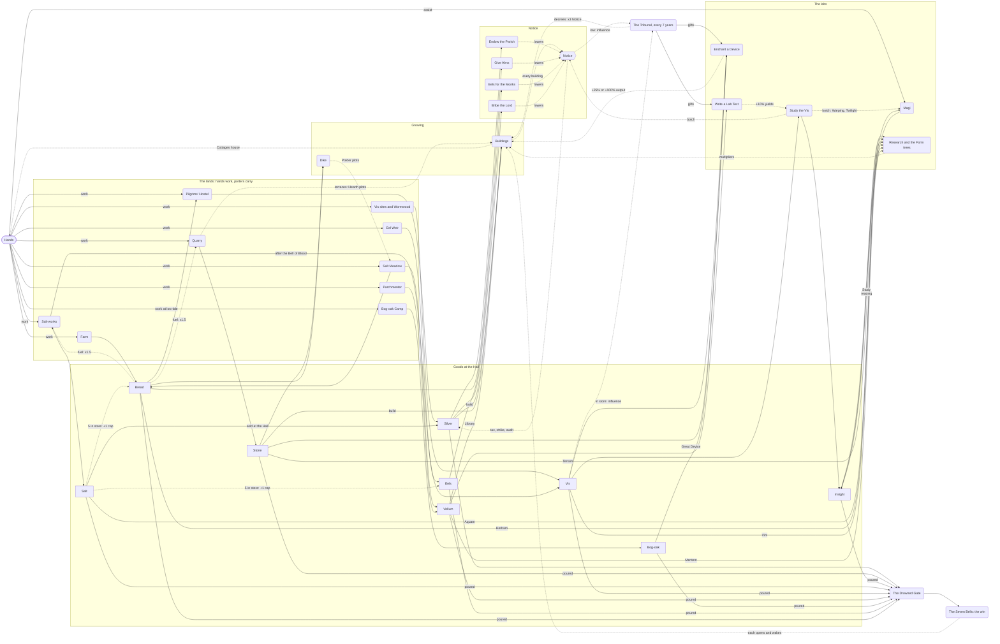

# Economy: zones, hands, buildings, carrying and storage

## The whole economy

Every good and how it turns into the others. Any change that adds a good, a building that makes or uses one, or a way to spend one updates this diagram.

## Zones

The covenant's lands are 3 **zones**, shown as sections of the Covenant tab.

| Zone | Plots | Notice factor | Carry distance | Allowed buildings |
| --- | --- | --- | --- | --- |
| Hearth | 8 | 0.5 (0 after the Aegis) | 0 (no porters needed) | Sanctum, Quarry; Storehouse and Library without a plot |
| Bocage | 12 | 1.5 | 1 | Farm, Parchmenter, Pilgrims' Hostel, Cottage |
| Marsh | 10, plus the Vis sites | 0.5 | 2 | Salt Pan, Vis Source (Vis sites only), Eel Weir (when unlocked) |
| Polder | 2 per dike | 1.0 | 1 | Salt Meadow |
| Scissy | 6, after the first bell | 0.5 | 1 | Bog-oak Camp |

- Each building takes 1 **plot** in its zone, with two exceptions: the Vis sites use the named sites, and Storehouses and Libraries are dug into the hill and take none.
- Every building adds its zone's Notice factor to Notice generation (`notice.md`), Vis sites and storage included, with one exception: a Cottage counts 0.25 wherever it stands, because a family's house is quiet.
- Buildings are never pulled down: the covenant only grows. When a zone is full, it can **buy land**: +3 plots for 60 Silver + 20 Stone, ×1.2 per purchase in that zone, with no limit. Any zone with plots can be bought into (Scissy after the first bell), except the Polder, which grows with dikes. Buying land adds no Notice. The Hearth also grows with terraces.
- **Housing is land.** Hands need Cottages and Cottages need Bocage plots, so a full Bocage also stops the covenant growing hands; buying Bocage land is how a covenant keeps growing people.
- **Why:** plots are cheap to add, so they shape *where* the covenant grows, not *whether*. The one hard budget is Notice: growth is the crime.

## Land from the sea

| Parameter | Value |
| --- | --- |
| Land | +3 plots; 60 Silver + 20 Stone × 1.2^k per zone; no limit |
| Dike | +3 Polder plots; 80 Stone + 80 Bread × 1.2^d |
| Terraces | +1 Hearth plot each; 500 × 1.3^n Stone quarried; up to 20 |

`[PLAYTEST: the careful sim reaches about 100 buildings by minute 60 on seeds 1–3, against about 35 before these prices.]`

The Marais de Dol really was won from the sea with dikes, from the 11th century on.

- **Dikes. Input:** once the Bocage is full, a card reveals the Polder zone and its **Build a dike** button.
- **System:** a dike costs 80 Stone + 80 Bread (for the diggers), ×1.2 per dike built, and adds 3 Polder plots. The Polder holds Salt Meadows, needs porters at distance 1, and has a Notice factor of 1.0, between the quiet Marsh and the loud Bocage.
- **Terraces. System:** quarrying Mont-Dol cuts terraces. The first opens after 500 Stone produced by Quarries over the run (whether stored, lost at the cap or poured), each next one after 1.3× more (650, 845…), up to 20. Each adds 1 Hearth plot. The Hearth card shows the Stone still needed.
- **Feedback:** a Chronicle line for each dike and terrace; the zone header counts plots.
- **Why:** a full zone asks for a new purchase, not a demolition. Dikes turn Stone and Bread into land, so a Bread surplus is always welcome; terraces make every Quarry a slow investment in the Hearth. Both grow the covenant toward the endgame's great reclamation (`backlog.md`, *No More Sea*).

## Hands

- **Start:** 4 hands in the trial, 6 in the full run.
- **Housing:** the Hall houses 8. Each Cottage houses 3 more.
- **Growth:** while there is free housing, 1 new hand arrives every 20 s and pays the **eel rent**: 10 Eels each in the full run. Without 10 Eels in store the 20 s wait pauses, so Eels cap arrivals at 0.5 Eels/s. Hands don't eat: the covenant feeds them from its lands without the player's help.
- **Bread is fuel.** Hard work needs calories: every Quarry and Salt-works worker burns 0.05 Bread/s and works ×1.5 while there is Bread in store. Without Bread they work at the base rate. Runs start with no Bread; the Bocage and its Farms open when the Hall is full (8 hands).
- **Jobs:** a hand is a **worker** (in one of a building type's **worker slots**) or a **porter** (assigned to a zone). Unassigned hands are idle.
- **Input:** each building type has − / + buttons for its workers, plus "fill" (as many as the slots allow). Each zone has − / + for porters.
- **Feedback:** the header shows "2 idle, of 14/17". The Hands card says whether Bread is fuelling the Quarries and Salt-works.
- **Why:** hands are the scarce resource. Every worker is a porter you didn't assign, and every new hand costs Eels and a place to live.

## Buildings

Buildings are counted per type. The next one costs base cost × 1.15^owned. Each building adds worker slots; output = workers × per-worker rate × multipliers.

| Building | Zone | Base cost | Worker slots | Per worker | Why build it |
| --- | --- | --- | --- | --- | --- |
| Salt Pan | Marsh | 20 Silver | 2 | 0.25 Salt/s | The main income: the Hall sells Salt for 1 Silver each, or keeps it to preserve food (below) |
| Farm | Bocage | 20 Silver | 2 | 0.2 Bread/s | Bread fuels the Quarries and Salt-works, and pays for alms, pilgrims and dikes |
| Quarry | Hearth | 40 Silver | 2 | 0.25 Stone/s | Stone pays for Sanctums, Storehouses and the Gate |
| Parchmenter | Bocage | 30 Silver | 1 | 0.15 Vellum/s | Vellum pays for Lab Texts and Libraries |
| Vis Source | Marsh Vis site (max 3) | 40 Silver | 2 | 0.08 Vis/s | Vis fuels experiments, the Aegis and the Gate |
| Sanctum | Hearth (max 3, 1 per magus) | 100 Silver + 50 Stone | 2 assistants | +25% to the magus's baseline Insight and experiment speed per assistant | A magus without a Sanctum does nothing |
| Pilgrims' Hostel | Bocage (unlocked with Quarries) | 40 Silver + 20 Stone | 1 | Uses 0.5 Bread/s, makes 1 Silver/s | Bread becomes money: the *miquelots* cross the bay to Mont-Saint-Michel. Idle while Bread is out |
| Salt Meadow | Polder | 30 Silver | 2 | 0.1 Bread/s + 0.05 Vellum/s | Sheep on the salt grass: mutton and skins, food and the labs' Vellum from one building |
| Cottage | Bocage | 30 Silver, ×1.06 per Cottage | 0 | Housing +3; Notice 0.25 | More hands |
| Storehouse | Hearth, no plot | 50 Silver + 20 Stone | 0 | Caps of every mundane good (Silver, Salt, Stone, Bread, Eels, Vellum, Bog-oak) ×1.25 each | Room to stockpile; it outgrows its own ×1.15 price |
| Library | Hearth, no plot | 40 Silver + 20 Vellum | 0 | Insight and Vis caps ×1.25 each | Room to save for big research |
| Eel Weir | Marsh (from the start of the full run; after `unlock:eel_weir` in the trial) | 15 Silver | 1 | 0.3 Eels/s × (1 + 0.5 × eel level) while the eels thread is open; ×1 after it ends | Eels pay the rent for new hands, are the gift that calms the monks (`notice.md`), and are the eels' standing temptation (`stories.md`) |
| Bog-oak Camp | Scissy (after the first bell) | 60 Silver + 30 Stone | 3 | 0.1 Bog-oak/s, only at low tide | Great Devices and the bells (`gate.md`) |
| Wormwood | A Vis site (after the third bell) | 40 Silver | 2 | 0.24 Vis/s | Three times the Tide Pool |

The 3 Vis sites are named and individually addressable: the Tide Pool, the Drowned Knight's Barrow, and the Regio Spring. Events can target one of them.

## Carrying

Goods made outside the Hearth count only once porters bring them to the Hall.

- A porter carries 1 good/s from the Bocage (distance 1) or 0.5 goods/s from the Marsh (distance 2).
- If a zone makes more than its porters can carry, output is throttled to what they carry. The surplus is not stored.
- Research raises carrying: *Mule Trains* ×2 for all zones, *Stones That Carry* ×3 for the Marsh.
- Goods going *out* to the Marsh (Stone for the Drowned Gate) are carried by the Marsh's porters at the same rates, sharing their capacity with goods coming in.
- **Feedback:** each zone header says it plainly: "Marsh: carried 1.8 of 2.4 goods/s · 3 porters". When porters are the bottleneck, the zone's porter + button pulses.
- **Why:** distance matters and the bottleneck is visible, without drawing any lines. Porters compete with workers for the same hands.

## Two incomes

Salt and pilgrims pay about the same Silver per hand, in different ways. Counting the hands that make a hostel's Bread and the porters on both sides:

| Income | Silver per hand | Costs |
| --- | --- | --- |
| Salt-works, no research, unfed | 0.17 | Many hands, quiet (Marsh, Notice ×0.5) |
| Salt-works with *Salt Rakes*, *Mule Trains* and Bread | about 0.33 | As above, and Farms for its fuel |
| Pilgrims' Hostel with *Self-Tilling Plough* and *Mule Trains* | about 0.33 | Few hands, but loud (the hostel and its Farms are in the Bocage, Notice ×1.5), and it stops when Bread runs out |

`[PLAYTEST: neither should dominate: salt suits a covenant short of Notice headroom, pilgrims one short of hands or with Bread to spare.]`

## Salt: sell or keep

- **Input:** a switch on the Salt-works card: **Selling** (the default) or **Keeping**.
- **System:** while selling, all Salt reaching the Hall is sold at 1 Silver each. While keeping, Salt stays in store up to its cap and only the overflow is sold. Every 5 Salt in store raises the Bread and Eels caps by 1. Switching back to selling sells the whole store at once.
- **Why:** salt was how the bay preserved its food. Keeping Salt trades Silver now for room to stockpile Bread for alms and Eels for fish days.

## Storage caps

Every good has a cap: a base, times multipliers. At the cap, new production of that good is wasted and the resource shows red "full".

| Good | Base cap | Multiplied by |
| --- | --- | --- |
| Silver | 500 | Storehouse (×1.25 each); *Hermetic Accounts* (×2); *Strongbox* (×1.5 each) |
| Salt, Stone, Eels, Bog-oak | 500, 200, 200, 200 | Storehouse (×1.25 each) |
| Bread | 200 | Storehouse (×1.25 each); +1 per 5 Salt in stock |
| Vellum | 50 | Storehouse (×1.25 each) |
| Vis | 30 | Library (×1.25 each); *Lead-Lined Chests* (×2) |
| Insight | 1,000 | Library (×1.25 each). Once founded, the Drowned Gate holds Insight with no cap (`gate.md`) |

- The Salt bonus to the Bread and Eels caps is added after the multipliers, and is 0 while Salt is being sold.
- **The price rule:** any price paid in a capped good grows at most ×1.25 per purchase, the Storehouse's step (land ×1.2, dikes ×1.2, the Form trees' goods ×1.25, the Notice levers ×1.5 in Silver and Bread, which Storehouses and Strongboxes keep in reach). Anything steeper is paid from the Gate, which has no caps.

**Why:** caps turn "awash" into "spend it or lose it". Storage costs Silver and Stone but no plot, and each one multiplies its caps by more than its own price grows (×1.25 against ×1.15). With the price rule, a Storehouse is always the way through a cap, never a dead end. This is Kittens Game's main constraint, without its soft-locks.

## Stacking

- Bonuses of the same kind add together: 3 Lab Texts give +30%, not ×1.1³.
- Bonuses of separate kinds multiply: research × Lab Texts × Devices × traits × assistants.
- Multipliers apply to output. Costs change only when an effect says so.
- **Why:** additive within a kind keeps each extra copy equally valuable; multiplying across kinds is what makes numbers go up.
